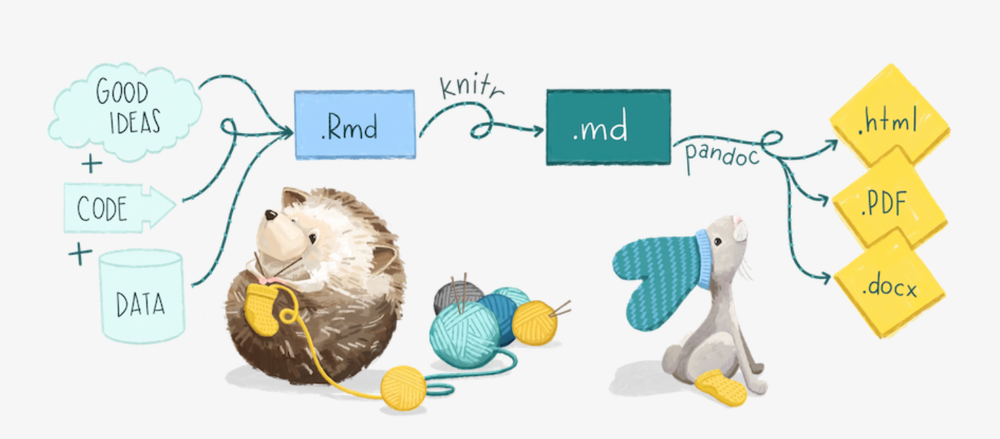

```{r child = "setup.Rmd"}
```

```{r xaringan-tile-view, echo=FALSE}
xaringanExtra::use_tile_view()
```

```{r xaringan-editable, echo=FALSE}
xaringanExtra::use_editable(expires = 1)
```


```{r xaringanExtra-clipboard, echo=FALSE}
htmltools::tagList(
  xaringanExtra::use_clipboard(
    button_text = "<i class=\"fa fa-clipboard\"></i>",
    success_text = "<i class=\"fa fa-check\" style=\"color: #90BE6D\"></i>",
    error_text = "<i class=\"fa fa-times-circle\" style=\"color: #F94144\"></i>"
  ),
  rmarkdown::html_dependency_font_awesome()
)
```

```{r xaringan-fit-screen, echo=FALSE}
xaringanExtra::use_fit_screen()
```

```{r xaringan-extra-styles, echo=FALSE}
xaringanExtra::use_extra_styles(
  hover_code_line = TRUE,         #<<
  mute_unhighlighted_code = TRUE  #<<
)
```

```{r xaringan-scribble, echo=FALSE}
xaringanExtra::use_scribble()
```

class: center, middle

## Retrospecto
---

## Modelo conceitual da análise de dados


---

## Tipos de dados

```{r echo=FALSE, message=FALSE, warning=FALSE}
knitr::include_graphics('img/continuous_discrete.png')
```

---

## Tipos de dados

```{r echo=FALSE, message=FALSE, warning=FALSE}
knitr::include_graphics('img/nominal_ordinal_binary.png')
```

---

## Tipos de dados

- Os tipos de dados mais comuns são `character`, `numeric`, `factor`e `logical`.

Character
```{r}
character <- "arroz"
class(character)
```

Numeric
```{r}
numeric <- 7
class(numeric)
```

---

## Tipos de dados

Factor
```{r}
factor <- as.factor(c("pato", "gato", "rato", "gato", "pato"))
class(factor)
levels(factor)
```

---

## Tipos de dados

Logical
```{r}
logical <- as.logical(c(0,1,1,0))
class(logical)
```

---

## Tipos de classes de objetos no R

- As classes de organização dos dados mais comuns são `vector`, `list`, `matrix` e `dataframe`.

.question[
Um vetor é uma seqüência de elementos de dados do mesmo tipo básico. Os elementos em um vetor são oficialmente chamados de componentes. No entanto, nós os chamaremos apenas de elementos e assumiremos que cada elemento ocupa uma posição no vetor.
]

---

## Tipos de classes de objetos no R

#### Índice em vetores:

```{r}
s <- c("aa", "bb", "cc", "dd", "ee") 
s[3] 
s[-3]
s[10]

```

---

## Tipos de classes de objetos no R

.question[
Uma matriz é uma coleção de elementos de dados dispostos em um layout bidimensional retangular. A seguir, um exemplo de uma matriz com 2 filas e 3 colunas.]

---

## Tipos de classes de objetos no R

```{r}
A = matrix(c(2, 4, 3, 1, 5, 7), # the data elements 
     nrow=2,                    # number of rows 
     ncol=3,                    # number of columns 
     byrow = TRUE)              # fill matrix by rows 
A

A[2, 3]
```    

---

## Tipos de classes de objetos no R

.question[
Uma lista é um vetor genérico que contém diferentes tipos de objetos.
]

```{r}
n <- c(2, 3, 5) 
s <- c("aa", "bb", "cc", "dd", "ee") 
x <- list(n, s, 3)   # x contains copies of n, s, b
x
```

---

## Tipos de classes de objetos no R

```{r}
slice <- x[2]
slice

x[[2]] # member - can be modified

```

---

## Tipos de classes de objetos no R

.question[
Um `dataframe` é usado para armazenar tabelas de dados. É uma lista de vetores de igual comprimento. Por exemplo, a seguinte variável `df` é uma `dataframe` contendo três vetores n, s, b.
]

```{r}
n <- c(2, 3, 5) 
s <- c("aa", "bb", "cc") 
b <- c(TRUE, FALSE, TRUE) 
df <- data.frame(n, s, b)       # df is a data frame
df
```


---

## Comunicação com RMarkdown

```{r packages, echo=FALSE, message=FALSE, warning=FALSE, include = FALSE}
library(tidyverse)
library(viridis)
library(sugrrants)
library(lubridate)
```

## Reprodutibilidade

.question[
O que significa ser "reprodutível"?
]

--

Objetivos no curto prazo:

- As tabelas e figuras são reprodutíveis a partir do código e dos dados?
- O código realmente faz o que você acha que faz?
- Além do que foi feito, é claro *por que* foi feito? 

Objetivos no longo prazo:

- O código pode ser usado para outros dados?
- Você pode estender o código para fazer outras coisas?

---

## RMarkdown

```{r echo=FALSE, out.width="100%"}

```
.footnote[
Alison Hill [Teaching in Production](https://rstudio-education.github.io/teaching-in-production/slides/index.html#1)
]

---

## Ambiente de trabalho do Rmarkdown

.tip[
O ambiente de seu documento R Markdown é separado do Console!
]

Lembre-se disso e espere que ele _o morda_ algumas vezes enquanto você aprende a trabalhar 
com R Markdown!

---

## Ambiente de trabalho do Rmarkdown

.pull-left[
Primeiro, rode em seu console:


```{r eval = FALSE}
x <- 2
x * 3
```


.question[
Tudo parece bem, eh?
]
]

--

.pull-right[
Digite então o código em um chunk no seu documento Rmarkdown


```{r eval = FALSE}
x * 3
```


.question[
O que aconteceu? Como fazer para rodá-lo?
]
]

.tip[
Dicas:    
`Ctrl + Alt + i`   
`Ctrl + Enter`
]


---

## Como usaremos o R Markdown?

- Cada tarefa / relatório / projeto / etc. é um documento R Markdown
- Você sempre terá um modelo de documento R Markdown para começar a atividade ou uma orientação quanto ao `template`

---

### Sua vez!

1. Instale o package `flexdashboard` (install.packages("flexdashboard"))
2. Gere um documento desse tipo no RStudio.
3. Inclua dados e representações simples. Pode utilizar o `mtcars` e as funções `plot()`, `hist()` e `boxplot()`   
4. Gere um `summary()` de algum dos vetores que compõe o dataframe. 

---

### Fazendo uma apresentação no R!

1. Instale os pacotes install.packages(c("xaringan", "xaringanExtra", "xaringanthemer"))
2. Gere um arquivo R markdown do tipo Ninja Xaringan Themer. 
3. `knit` o documento. 
4. Visite o site [color-hex](https://www.color-hex.com/) e altere o padrão de cores da apresentação.

---

## Encaminhamentos:

Atividade 3
Lab 3.1

.center[
## ENGAJAMENTO!
]

---

class: inverse, center, middle

# DÚVIDAS?


